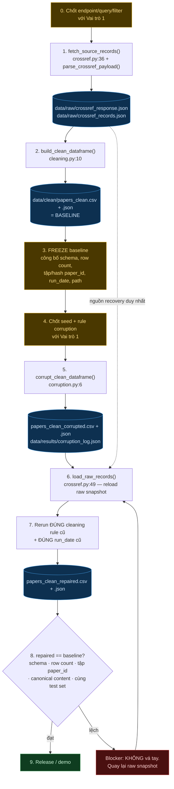
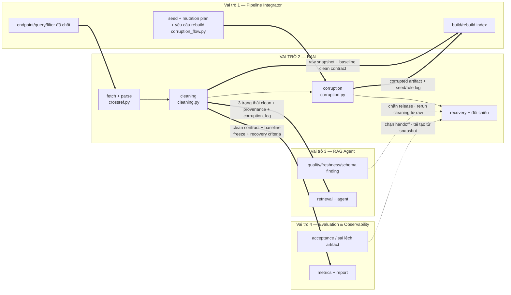

# Vai trò 2 — Flow thực thi và handoff

## A. Các bước của Vai trò 2

## B. Input vào / Output ra các vai trò khác

## C. Bảng handoff rút gọn

| Hướng | Bạn nhận / gửi gì | Accept khi đối tác trả lời đúng | Nếu fail |
| --- | --- | --- | --- |
| Vai trò 1 → 2 | endpoint, query, filter | URL + params xác định | Chặn fetch |
| Vai trò 1 → 2 | seed, mutation plan, target | seed, target, log fields | Chặn mutation, không tự đoán rule |
| 2 → Vai trò 1 | raw snapshot + baseline CSV/JSON | schema, row count, tập `paper_id`, run_date, path | Dừng build index, phát hành snapshot mới có provenance |
| 2 → Vai trò 3 | 3 trạng thái clean + corruption log | schema, row count, tập `paper_id`, path | Dừng quality check |
| Vai trò 3 → 2 | schema/freshness/quality finding | artifact, rule tái lập, recovery source | Dừng release, reload raw + rerun cleaning |
| 2 → Vai trò 4 | clean contract, baseline freeze, recovery criteria | schema, row count, `paper_id`, canonical check, cùng test set | Dừng demo/release |
| Vai trò 4 → 2 | acceptance result, sai lệch artifact | snapshot, run_date, corruption log, trạng thái re-clean | Dừng handoff, tái tạo từ raw + accept lại |

## D. Clean contract — 11 cột bắt buộc

`paper_id` · `title` · `summary` · `published` · `authors_joined` · `categories_joined` · `abs_url` · `pdf_url` · `text_for_embedding` · `age_days` · `summary_chars`

`paper_id` là khóa ổn định (DOI). `text_for_embedding` sinh deterministic từ nội dung canonical đã clean.

## E. Luật cứng

- Không sửa tay file corrupted.
- Không copy baseline rồi gọi là repaired.
- Repaired chỉ được sinh bằng cách reload `data/raw/crossref_records.json` và rerun cleaning.
- Metric recovery một mình KHÔNG đủ để accept — phải đối chiếu đủ 5 tiêu chí ở bước 8.
- Không ghi secret vào artifact hay log.
